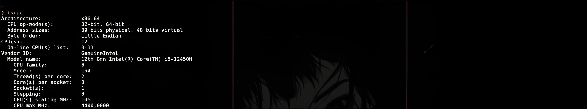

# CostManagement
CostManagement is a personal finance management application developed using C# and WPF. 
     It allows users to add, edit and delete expenses, as well as view the total balance.

 # ATTENTION  ❗ ❗ ❗
 
  The project was designed for training purposes, it will not be developed further.
     
# Functions 
- **Add Expenses**: Allows users to add new expenses by specifying a description, amount and date.
- **Edit Expenses**: Allows users to edit existing expenses.
- **Deleting Expenses**: Allows users to delete existing expenses.
- **View Total Balance**: Displays the total balance of all expenses.

# Installation for Windows 


 VARIANT 1️⃣


 1. Clone the repository in any folder on your pc.
    
  ```bash
        https://github.com/db-NeverRmore/CostManagement.git
  ```
 2. Then open Visual Studio

 3.  Then press the button on a start page  " Open a project or solution "

  VARIANT 2️⃣

  1. Open Visual Studio

  2.  Then press the button on a start page " Clone a repository "

  3.  Then in the list of your projects you will see cloned repostiry.


# Installation for Linux ❗

> **WARNING:** WPF was developed specifically for the Windows operating system, so it is very difficult to run this project on Linux distributions without extraneous tools, and the project is likely to work strangely.
> 
> That's why you will have a choice of 2 options to start the project.
      
VARIANT 1️⃣ - Wine

 # Ubuntu 
 1. Step 1

First, check whether the system is 32 or 64 bit 

The first line is the bit capacity of your system. 
         
     
  2. Step

Install the wine 
----

```bash 
sudo apt install wine64

```
If you have 64 bit

```bash
sudo apt install wine32

```

Then check the version of wine 

```bash
wine --version

```
     
     
          

   
 
     

   # Usage
1. Open the project which you have clonned
      
2. Build the project with CTRL+f5 (keys by default to build the project ) or click the button on a toolbar.

3. Enjoy ! ✅


     


    


